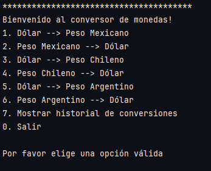
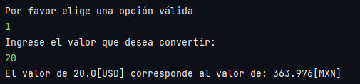
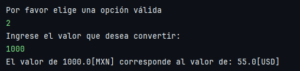
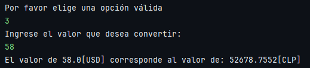
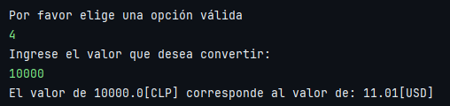
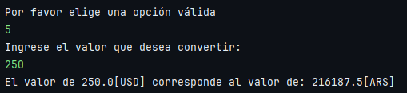
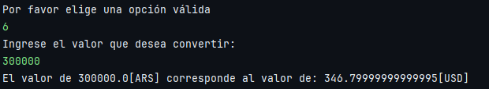
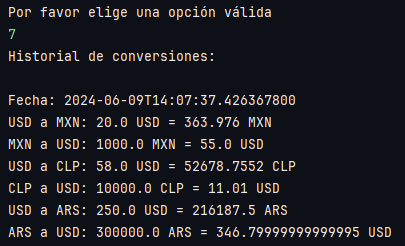

# Conversor de Moneda

Este proyecto, llamado "Conversor de Moneda", es una aplicación de consola en Java que permite a los usuarios convertir diferentes tipos de monedas, así como poder ver su historial de conversiones.

## Descripción del proyecto
El proyecto utiliza Java como lenguaje de programación. La estructura del proyecto está organizada en varias clases, incluyendo `ObtenerMoneda`, `ConvertirMoneda` y `Moneda`.

La aplicación permite a los usuarios convertir entre diferentes tipos de monedas, incluyendo USD, MXN, CLP y ARS. Los usuarios pueden ingresar la cantidad que desean convertir y la aplicación mostrará el resultado de la conversión.

La comunicación con la aplicación se realiza a través de la consola, con el siguiente menú:

                    1 - Convertir de USD a MXN
                    2 - Convertir de MXN a USD
                    3 - Convertir de USD a CLP
                    4 - Convertir de CLP a USD
                    5 - Convertir de USD a ARS
                    6 - Convertir de ARS a USD
                    7 - Mostrar historial de conversiones
                    0 - Salir

## Organización del código
El proyecto está organizado en varias clases:

- `ObtenerMoneda`: Esta clase se encarga de obtener los valores de conversión para las diferentes monedas.
- `ConvertirMoneda`: Esta clase se encarga de realizar las conversiones de moneda.
- `Moneda`: Esta clase define los valores de conversión para las diferentes monedas.

Además, contamos con la clase `Principal` que maneja la lógica principal de la aplicación. Esta clase maneja la interacción con el usuario y la ejecución de las funcionalidades. Cada opción mostrada en el menú se realiza a través de un `switch`, definido en `Principal`.

## Organización del código de manera gráfica

## Demostración de la aplicación
<table>
  <tr>
    <td>
      
Menú: muestra las opciones a elegir por el usuario

      
    </td>
    <td>
      
Opción 1: Convertir de dólares a pesos mexicanos 

      
    </td>
  </tr>
  <tr>
    <td>
      
Opción 2: Convertir de pesos mexicanos a dólares 

      
    </td>
    <td>
      
Opción 3: Convertir de dólares a pesos chilenos 

      
    </td>
  </tr>
  <tr>
    <td>
      
Opción 4: Convertir de pesos chlenos a dólares 

      
    </td>
    <td>
      
Opción 5: Convertir de dólares a pesos argentinos 

      
    </td>
  </tr>
  </tr>
  <tr>
    <td>
      
Opción 6: Convertir de pesos argentinos a dólares 

      
    </td>
    <td>
      
Opción 7: Mostrar el historial de conversiones 

      
    </td>
  </tr>
</table>

## Dependencias
El proyecto no requiere de dependencias externas.

## Ejecución de la aplicación
**Clonar el repositorio**

Para empezar, necesitas clonar el repositorio en tu máquina local. Puedes hacerlo utilizando el siguiente comando en tu terminal:
   `git clone https://github.com/mendodevv/desafio-literalura.git`
   
O si lo prefieres, puedes presionar el botón verde `code<>` del repositorio y descargar los archivos como ZIP

1. Para ejecutar la aplicación, simplemente ejecute la clase `Principal`. La aplicación se comunicará con el usuario a través de la consola.
2. Una vez que la aplicación esté en ejecución, puedes interactuar con ella a través de la consola. Se te presentará un menú con varias opciones para realizar conversiones entre diferentes monedas. Simplemente sigue las instrucciones en pantalla para interactuar con la aplicación.

NOTA: Para ver el historial de tus conversiones, cierra la aplicación. Verás que se genera un archivo `conversiones.txt`, en el mismo estará la fecha en la que usaste la aplicación, y todas las conversiones que hayas realizado en esa fecha. Asimismo una vez hayas usa

## Tecnologías utilizadas
- Java SE17
- Para el desarrollo del código, se uso el IDE IntelliJ

## Estado del proyecto

Finalizado

## Licencias

MIT License.

